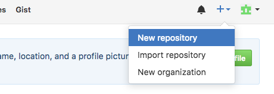
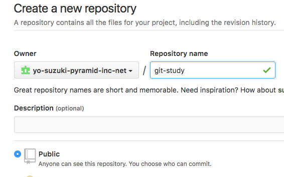
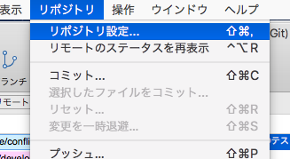
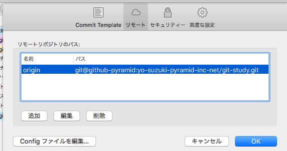

git-study
===

- まず、このリポジトリをcloneしてください。   
```
git clone https://github.com/yo-suzuki-pyramid-inc-net/git-study.git -b develop
```
- SSHでアクセスする場合は
```
git clone git@github.com/yo-suzuki-pyramid-inc-net/git-study.git -b develop
```

- 各自でPushを行うため、リモートリポジトリを切り替えます
```
git remote remove origin
```
- githubにログインしてリポジトリを作成します

---

---
- リモートリポジトリを作成した自分のgithubものに変更します
```
git remote add origin https://github.com/<アカウント>/git-study.git
```
- ソースツリーの場合は以下のように [リポジトリ]-[リポジトリ設定]-[リモートタブ]からoriginを選択して編集する



- これでPush先が自分のgithubリポジトリに切り替わりました。  
以降はPushしてもだれにも影響を与えませんので、いろいろ試してみてください。
test3
